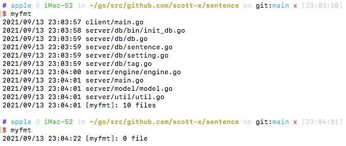

# myfmt

Normally our golang code is located in diffrent places, IDE can't format it at one time.

With this tool, you can format your go code more efficiently.


```bash
# install
go install github.com/scott-x/myfmt
# go to your project folder that contains go.mod, then run myfmt
myfmt
```

Example as below:

When running `myfmt` the 1st time, every file with `.go` extention will be formatted.

When running `myfmt` the 2nd time, the tool will just format the file which is updated. This is a great feature, since it avoids unnecessary format.

